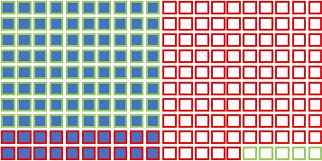
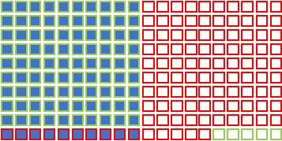

background-image: url(./graphics/LowAmountOfRodeos.jpg)
background-size: cover

```{r setup, include=FALSE}
options(htmltools.dir.version = FALSE)
set.seed(53059)
```

---

# Common HW 3 Issues

When you include a difference score in the model, make sure to define it!

$PrePostRunDiff_i = RUNPULSE_i - RSTPULSE_i$

Note the subscripts: each person gets a (potentially different score)

--

Then, always use your descriptively named variables in models:

MODEL A: $PrePostRunDiff_i = \beta_0 + \varepsilon_i$

--

You do NOT need extra stuff:

No: $PrePostRunDiff_i = Y_i = \beta_0 + \varepsilon_i$

--

---

# Common HW 3 Issues

Same with null hypethsis expressions:

Yes: $\beta_0 = 0$

No: $PrePostRunDiff_i = Y_i = 0 = \beta_0$

This is not only overwrought, but incorrect. Our null hypothesis is only about **parameter estimates**, not predictions on individual scores.

---

# Common HW 3 Issues

Later on, we will have complex models; extra things just make it hard:

$$LvlDifQ_i = \beta_0 + \beta_1 * AffC_i + \beta_2 * ExpC_i + \beta_3 * (AffC_i \times ExpC_i) +\\
\beta_4 * age_i + \varepsilon_i$$

We want to try and keep things manageable in situations like these.

---

# Power

200 hypotheses! Half are really true, and half are really false.<sup>1</sup>


.footnote[
[1] We can never really know how many or what proportion of investigated hypotheses are true or false.
]

---

# Power

$(1-\beta) = .80$ & $\alpha=.05$



---

# Power

$(1-\beta) = .90$ & $\alpha=.05$



---

# Power

Notice, power and alpha refer to *different subsets.*


---

# Power

But why does our HIT RATE (power) change?

--

Simultation time. 

Our population: 1,000,000 runners. Mean heart rate = 65, sd = 10

---

# Power

```{r out.height="320px"}
pop <- rnorm(1000000, mean = 65, sd = 10)
hist(pop)
```

---

# Power

Research question: do runners in the U.S. have a lower heart rate (HR) than the national average of 72?

Study design: I sample runners and measure their HR.

Money problem: I can only do 20!

Let's try it.

```{r out.height="300px"}
study1 <- sample(pop, 20)
mean(study1)
sd(study1)
```

---

# Power

.center[
```{r, out.height="300px"}
hist(study1)
```
]

---

# Power

Let's do a model comparison.

- Model A: $hr_i = \beta_0 + \varepsilon_i$
- Model C: $hr_i = 72 + \varepsilon_i$

```{r}
library(lmSupport)
study1_72 <- study1 - 72
m1.a <- lm(study1_72 ~ 1)
m1.c <- lm(study1_72 ~ 0)
```

---

# Power

.pull-left[
```{r}
modelSummary(m1.a)
```
]

.pull-right[
$$SSEa = 1561.8$$

$$SSEc = $$
]
---

# Power

.pull-left[
```{r}
modelSummary(m1.c)
```
]

.pull-right[
$$SSEa = 1561.8$$

$$SSEc = 1752.8$$
]

---

# Power

.pull-left[
$$PRE = \frac{1752.8 - 1561.8}{1752.8} = .109$$
]

.pull-right[
$$SSEa = 1561.8$$

$$SSEc = 1752.8$$
]

---

# Power

Do it again! I'm taking shortcuts this time.

```{r}
study2 <- sample(pop, 20); study2_72 <- study2 - 72
m2.a <- lm(study2_72 ~ 1); m2.c <- lm(study2_72 ~ 0)
modelCompare(m2.c, m2.a)
```

---

# Power

How different are these?!

.pull-left[
```{r, results='asis'}
modelCompare(m1.c, m1.a)
```
]

.pull-right[
```{r, results='asis'}
modelCompare(m2.c, m2.a)
```

]

Why such different results?

---

# Power

Sampling!!!

.center[
```{r, out.height="300px"}
hist(pop)
```
]

In a population like this, what happens with small samples? 

---

# Power

To see this at scale, do it 10,000 times. $PRE_{crit} = .187$ for $PA - PC = 1$ & $n - PA = 19$

```{r, out.height="180px"}
presSmall <- replicate(
  10000,
  {
    sam <- sample(pop, 25)
    SSEa <- sum((sam - mean(sam))^2); 
    SSEc <- sum((sam - 72)^2)
    return((SSEc - SSEa) / SSEc)
  }
)
hist(presSmall); abline(v = .187, col = 'red')
```

???

```{r}
mean(presSmall >.187)
```


---

# Power

Do it 10,000 times *with a larger sample*. Now, $PRE_{crit} = .038$

```{r, out.height="200px"}
presBig <- replicate(
  10000,
  {
    {{sam <- sample(pop, 100)}}
    SSEa <- sum((sam - mean(sam))^2); 
    SSEc <- sum((sam - 72)^2)
    return((SSEc - SSEa) / SSEc)
  }
)
hist(presBig); abline(v = .038, col = 'red')
```

???

```{r}
mean(presSmall >.038)
```

---

# Power

.pull-left[
```{r, out.height="320px", out.width="350px"}
hist(presSmall, xlim = c(0, 1.0))
abline(v = .151, col = 'red')
```

]

.pull-right[
```{r, out.height="320px", out.width="350px"}
hist(presBig, xlim = c(0, 1))
abline(v = .038, col = 'red')
```

]


---

# Power

Let's do this again with the big sample size, but change the **effect size** (still a big sample).

Changing effect size can be done by using a null that is *really* inconsistent with my population's data. Why? Which numbers change in PRE's calculation?

$$PRE = \frac{SSEc - SSEa}{SSEc}$$

--

Importantly, what other ways can we make PRE bigger?

--

Anything that reduces **error** in Model A as compared to Model C:

- Improve measurement technique
- Choose big differences to study
- Use covariates to reduce the amount of unexplained variance in Model A (we'll talk about this one more later)

---

# Power

```{r, out.height="300px"}
presBigEffect <- replicate(
  10000,
  {
    sam <- sample(pop, 100)
    SSEa <- sum((sam - mean(sam))^2); 
    {{SSEc <- sum((sam - 85)^2)}}
    return((SSEc - SSEa) / SSEc)
  }
)
```


---

# Power

.pull-left[
```{r, out.height="320px", out.width="350px"}
hist(presBig, xlim = c(0, 1.0))
abline(v = .038, col = 'red')
```

]

.pull-right[
```{r, out.height="320px", out.width="350px"}
hist(presBigEffect, xlim = c(0, 1))
abline(v = .038, col = 'red')
```

]

---

# Power

Remember, in our population (we made it at the beginning), the alternative is true! The average HR was lower than 72.

Josh's app does this for both the alternative and the null.

(https://correll.shinyapps.io/power/)


---

# Calculating Power

It's really easy, but you'll need these formulas:

$$\hat{\eta}^2 = 1 - (1 - PRE) \frac{n - PC}{n - PA}$$

$$f^2 = \frac{\hat{\eta}^2}{1 - \hat{\eta}^2}$$

---

# Calculating Power

```{r}
library(pwr)
(eta2 <- 1 - (1 - .1) * (25 / 24))
(f2 <- eta2 / (1 - eta2))
pwr.f2.test(u=1, v=24, f2=f2, sig.level=.05) # leaving out `power`
```

---

# Calculating Power

We can also do a "sensitivity analysis" for a given sample size. What is the smallest effect we can detect at 80% power, given a certain sample?

```{r}
pwr.f2.test(u=1, v=24, sig.level=.05, power=.80) 
# I'm leaving out `f2`
```
